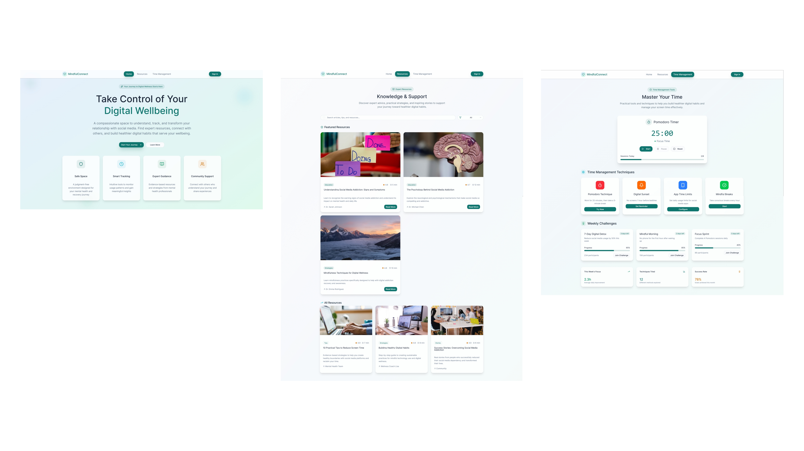
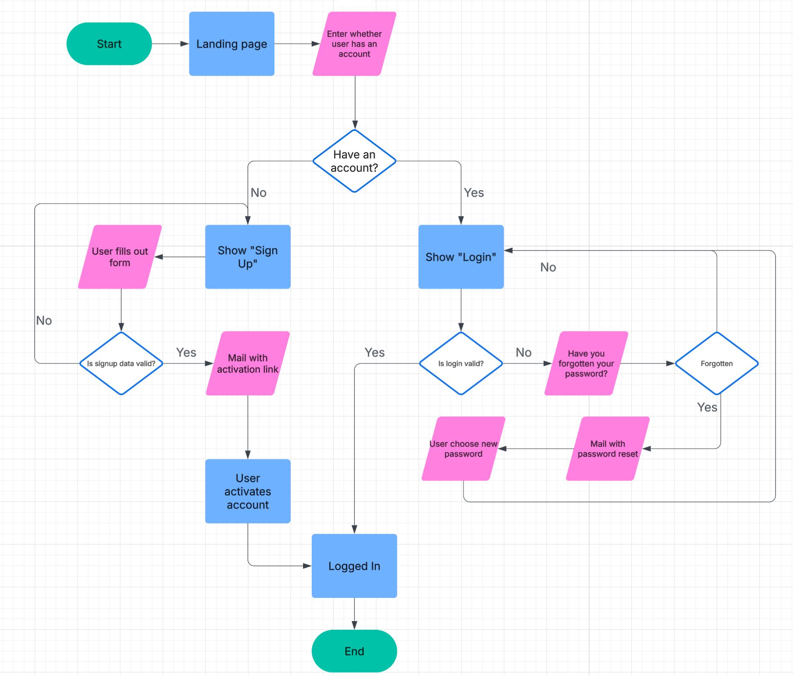

# COMPUTING ASSESSMENT TASK 3 — JAYDEN PITZING — 2025

---

## Project Description

> **A web page with resources and articles to help users find information and solutions for social media addictions.**  
> This site is a safe space for users to reduce their addiction to social media. It tracks time spent on each platform and provides tips based on usage.

---

## Functional Requirements

- Users can create accounts and log in securely.
- Users can search for topics and filter posts by category.
- Users can access a resource section with articles and tips.
- Users can track the time spent on social media apps.

---

## Non-Functional Requirements

- The forum should load within **5 seconds** on most devices.
- The interface should be **responsive**.
- Content must be **backed up daily** to prevent data loss.
- The design should be **simple and intuitive** with a clean colour scheme.

---

# Project Task 2

## Design Choices

### Colour Palette

| Role              | Hex Code  | Usage                                   |
|-------------------|-----------|-----------------------------------------|
| Primary Blue      | #1976D2   | Main buttons, active nav items          |
| Secondary Amber   | #FFC107   | Secondary buttons, link hovers          |
| Accent Orange     | #FF5722   | Highlights, badges, notifications       |
| Success Green     | #4CAF50   | Success messages, confirmations         |
| Error Red         | #E53935   | Error messages, destructive actions     |
| Light Grey        | #F5F5F5   | Page background, input field backgrounds|
| Dark Charcoal     | #212121   | Primary text, headings                  |

### Typography

| Element           | Font Family               | Weight | Size  | Line Height |
|-------------------|--------------------------|--------|-------|-------------|
| Heading 1         | Montserrat, sans-serif   | 700    | 32px  | 40px        |
| Heading 2         | Montserrat, sans-serif   | 600    | 24px  | 32px        |
| Heading 3         | Montserrat, sans-serif   | 500    | 20px  | 28px        |
| Body Text         | Roboto, sans-serif       | 400    | 16px  | 24px        |
| Button Label      | Roboto, sans-serif       | 500    | 14px  | 20px        |
| Caption / Metadata| Roboto, sans-serif       | 300    | 12px  | 16px        |
| Code Snippets     | JetBrains Mono, monospace| 400    | 14px  | 20px        |

### Image & Icon Choice

| Asset Type     | Style                              | Source & Format                        |
|----------------|------------------------------------|----------------------------------------|
| Illustrations  | Flat, duotone with minimal accents | Custom SVG exports                     |
| Icons          | Line icons with 2px stroke         | Feather Icons (SVG)                    |
| Photographs    | High-contrast, muted backgrounds   | Unsplash (JPG/WebP, optimised to 80%)  |
| UI Patterns    | Subtle shadows, rounded corners    | Built-in CSS variables, reusable components |

---

# Project Task 3

## Design Choices

### Colour Palette

| Role            | Hex Code  | Usage                                         |
|-----------------|-----------|-----------------------------------------------|
| Primary Teal    | #4FD1C5   | Main buttons, active nav items, interactive elements |
| Accent Amber    | #F6AD55   | Secondary buttons, link hovers, highlights    |
| Success Green   | #48BB78   | Success messages, confirmations, progress indicators |
| Error Red       | #E53E3E   | Error messages, destructive actions           |
| Light Grey      | #F7FAFC   | Page background, input field backgrounds      |
| Dark Charcoal   | #2D3748   | Primary text, headings                        |

### Typography

| Element           | Font Family           | Weight | Size  | Line Height |
|-------------------|----------------------|--------|-------|-------------|
| Heading 1         | Poppins, sans-serif  | 700    | 32px  | 40px        |
| Heading 2         | Poppins, sans-serif  | 600    | 24px  | 32px        |
| Heading 3         | Poppins, sans-serif  | 500    | 20px  | 28px        |
| Body Text         | Lato, sans-serif     | 400    | 16px  | 24px        |
| Button Label      | Lato, sans-serif     | 500    | 14px  | 20px        |
| Caption / Metadata| Lato, sans-serif     | 400    | 12px  | 16px        |

### Image & Icon Choice

| Asset Type     | Style                              | Source & Format                        |
|----------------|------------------------------------|----------------------------------------|
| Icons          | Line icons with 2px stroke         | Feather Icons (SVG)                    |
| Photographs    | Natural light, muted backgrounds   | Unsplash (JPG/WebP, optimised to 80%)  |
| UI Patterns    | Subtle shadows, rounded corners    | Built-in CSS variables, reusable components |

---

# Project Task 4

---

## Test Cases

| **Test Case ID** | **Scenario**                                      | **Preconditions**                                 | **Steps**                                                                                                                                                                                                 | **Expected Result**                                                                                                                                                                                                 | **Priority**      |
|:----------------:|:--------------------------------------------------|:--------------------------------------------------|:----------------------------------------------------------------------------------------------------------------------------------------------------------------------------------------------------------|:--------------------------------------------------------------------------------------------------------------------------------------------------------------------------------------------------------------------|:-----------------:|
| TC‑01            | New user sign‑up and activation success           | No existing account for the email                 | 1. Open Sign Up. 2. Enter valid name, unique email, strong password. 3. Submit. 4. Open activation email and click link within expiry.                                                          | - Account created as Pending. - Activation email sent. - Token validates. - Status becomes Active. - Session created. - Redirected to Dashboard. - Message: "Account activated and logged in."     | **Medium** 🟨|
| TC‑02            | Existing user login fail, then password reset success | Account exists, status Active; user doesn’t remember password | 1. Open Login. 2. Enter correct email, wrong password. 3. See error. 4. Click “Forgot Password?”. 5. Submit email. 6. Click reset link within expiry. 7. Enter strong new password and submit. | - Initial login rejected. - Reset email sent. - Token validates. - Password updated. - Failed_attempts reset. - Session created. - Redirected to Dashboard. - Message: "Password updated."      | **Medium** 🟨|

# Website Making Stuff
Note: Certain portions of code are from figma, built in visual studio ai was used to transform the programming language into the correct one. Certain files like menu.html and layout.html for some reason provide no reason now, menu.html has been deprecated, layout.html will be depricated soon. The menu.html and layout.html are not required for the website to operate.
I got 100 for the lighthouse report (performance), which I believe is pretty good

## How to Run the Web Application

1. **Open the project folder in VS Code.**
2. **Ensure you have Python and Flask installed.**
   - You can install Flask by running:  
     `pip install flask`
3. **Open a terminal in VS Code.**
4. **Navigate to the project directory if needed.**
5. **Run the Flask application:**
   - Use:  
     `python main.py`
6. **Follow any additional instructions in `instruction.file` if present.**
7. **Open your browser and go to** `http://localhost:5000` **to view the site.**