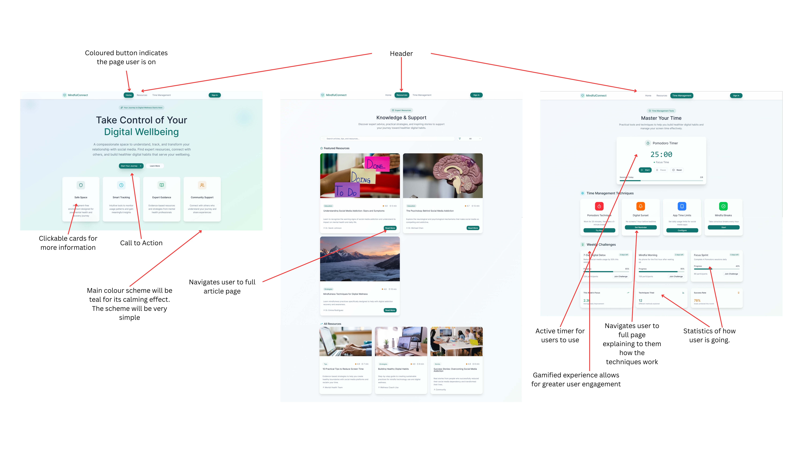

# COMPUTING ASSESSMENT TASK 3 — JAYDEN PITZING

---

## 1. Project Description

> **A web page with resources and articles where people can find out information and solutions to social media addictions.**  
> This is a safe space for users to use this site to reduce their addiction to certain social medias. This site can track the time that they spend on each social media that the user uses and provides tips based on how much time they are spending on the social media.

---

## 2. Functional Requirements

- **Users can create accounts and log in securely.**
- **Users can search for topics and filter posts by category.**
- **Users can access a resource section with articles and tips.**
- **Users can track the time spent on social media apps.**

---

## 3. Non-Functional Requirements

- The forum should load within **5 seconds** on most devices.
- The interface should be **responsive**.
- Content must be **backed up daily** to prevent data loss.
- The design of the forum should be **simple and intuitive** with a simple colour scheme.

---

# PROJECT TASK 2

## Design Choices

### Colour Palette

| Role              | Hex Code  | Usage                                   |
|-------------------|-----------|-----------------------------------------|
| Primary Blue      | #1976D2   | Main buttons, active nav items          |
| Secondary Amber   | #FFC107   | Secondary buttons, link hovers          |
| Accent Orange     | #FF5722   | Highlights, badges, notifications       |
| Success Green     | #4CAF50   | Success messages, confirmations         |
| Error Red         | #E53935   | Error messages, destructive actions     |
| Light Grey        | #F5F5F5   | Page background, input field backgrounds|
| Dark Charcoal     | #212121   | Primary text, headings                  |

### Typography

| Element           | Font Family               | Weight | Size  | Line Height |
|-------------------|--------------------------|--------|-------|-------------|
| Heading 1         | Montserrat, sans-serif   | 700    | 32px  | 40px        |
| Heading 2         | Montserrat, sans-serif   | 600    | 24px  | 32px        |
| Heading 3         | Montserrat, sans-serif   | 500    | 20px  | 28px        |
| Body Text         | Roboto, sans-serif       | 400    | 16px  | 24px        |
| Button Label      | Roboto, sans-serif       | 500    | 14px  | 20px        |
| Caption / Metadata| Roboto, sans-serif       | 300    | 12px  | 16px        |
| Code Snippets     | JetBrains Mono, monospace| 400    | 14px  | 20px        |

### Image & Icon Choice

| Asset Type     | Style                              | Source & Format                        |
|----------------|------------------------------------|----------------------------------------|
| Illustrations  | Flat, duotone with minimal accents | Custom SVG exports                     |
| Icons          | Line icons with 2px stroke         | Feather Icons (SVG)                    |
| Photographs    | High-contrast, muted backgrounds   | Unsplash (JPG/WebP, optimised to 80%)  |
| UI Patterns    | Subtle shadows, rounded corners    | Built-in CSS variables, reusable components |

---

# PROJECT TASK 3

## Design Choices

### Colour Palette

| Role            | Hex Code  | Usage                                         |
|-----------------|-----------|-----------------------------------------------|
| Primary Teal    | #4FD1C5   | Main buttons, active nav items, interactive elements |
| Accent Amber    | #F6AD55   | Secondary buttons, link hovers, highlights    |
| Success Green   | #48BB78   | Success messages, confirmations, progress indicators |
| Error Red       | #E53E3E   | Error messages, destructive actions           |
| Light Grey      | #F7FAFC   | Page background, input field backgrounds      |
| Dark Charcoal   | #2D3748   | Primary text, headings                        |

### Typography

| Element           | Font Family           | Weight | Size  | Line Height |
|-------------------|----------------------|--------|-------|-------------|
| Heading 1         | Poppins, sans-serif  | 700    | 32px  | 40px        |
| Heading 2         | Poppins, sans-serif  | 600    | 24px  | 32px        |
| Heading 3         | Poppins, sans-serif  | 500    | 20px  | 28px        |
| Body Text         | Lato, sans-serif     | 400    | 16px  | 24px        |
| Button Label      | Lato, sans-serif     | 500    | 14px  | 20px        |
| Caption / Metadata| Lato, sans-serif     | 400    | 12px  | 16px        |

### Image & Icon Choice

| Asset Type     | Style                              | Source & Format                        |
|----------------|------------------------------------|----------------------------------------|
| Icons          | Line icons with 2px stroke         | Feather Icons (SVG)                    |
| Photographs    | Natural light, muted backgrounds   | Unsplash (JPG/WebP, optimised to 80%)  |
| UI Patterns    | Subtle shadows, rounded corners    | Built-in CSS variables, reusable components |
