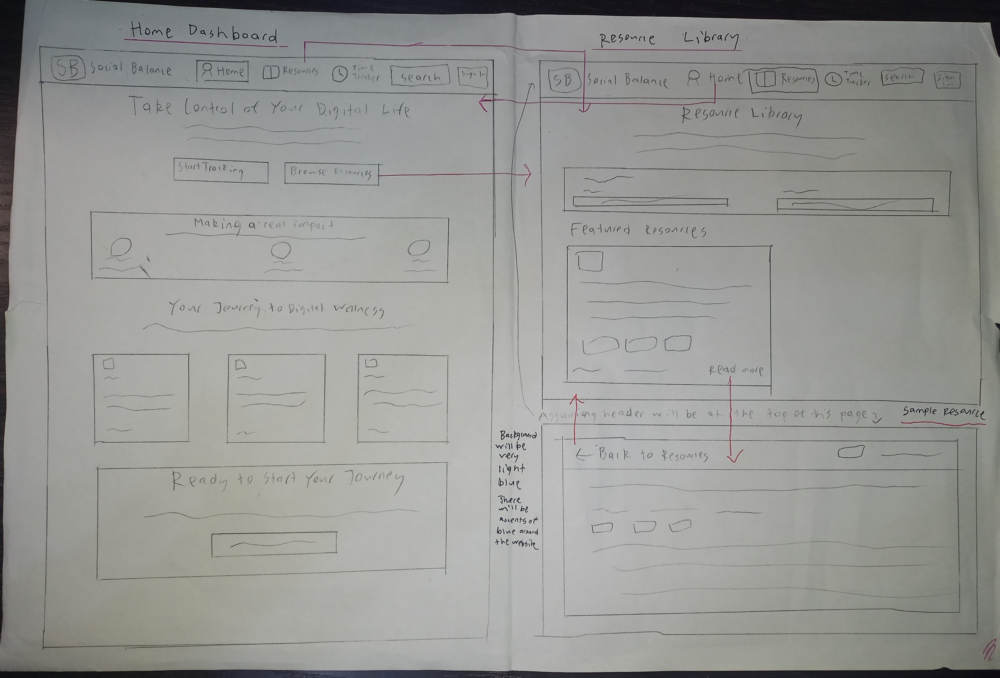

# COMPUTING ASSESSMENT TASK 3 — JAYDEN PITZING

---

## Project Description

> **A web page with resources and articles where people can find out information and solutions to social media addictions.**  
> This is a safe space for users to use this site to reduce their addiction to certain social medias. This site can track the time that they spend on each social media that the user uses and provides tips based on on how much time they are spending on the social media.

---

## Functional Requirements

- **Users can create accounts and log in securely.**
- **Users can search for topics and filter posts by category.**
- **Users can access a resource section with articles and tips.**
- **Users can track the time spend on social media apps.**

---

## Non-Functional Requirements

- The forum should load within **5 seconds** on most devices.
- The interface should be **responsive**.
- Content must be **backed up daily** to prevent data loss.
- The design of the forum should be **simple and intuitive** with a simple colour scheme.

---

## Project Task 2

## Project Task 3
